# Nansen: on-chain pipeline design


----------


This doc was (proudly) written by a human [❌🤖] as SOT (source of truth) for 🤖 agent|spec driven developement.

> **Quick note:** I may have some dangling branches and try to improve this and the codebase if I have some spare time :) The overall layout shouldn't change too much though, code may be debugged further and slides be beautified on some spare time but that's it.


## 1. Introduction: (the "what")

### 1.1 Labelling

On-chain address labeling is a pretty open topic, with many companies and participants taking part in it with different approaches. We could summarize labelling as:

> *The process of adding a qualitative descriptor that provides information regarding the behavior, nature or origin of an address or address operator. We could extend this for other kinds of labels (like soft scores or quantiles) that are, in a similar fashion, summarized information tagging the address in question.*

It's important to take into account that a correct approach towards labelling should consider that:
- Labels are **timely**, e.g. they are aligned with a snapshot in time, dynamic, and mutable (we will talk about this in the data modeling part), there is a time dimension that needs to be part of our data model and our grain decision/s.
- Labels are **actionable**, they should be able to add information to act uppon.
- They should be **trustworthy**, either inferred from on-chain info or (in some cases) from external sources with high confidence.

The concept of labelling really is an open-ended problem. From a customer centric, bottom up approach, we need to understand who our customers & users are to derive what a valuable label means. Labels answer questions like:

- ***WHO is this entity?:*** exchanges, treasuries, protocol builders, whales, market makers, smart contracts (which may have automated behavior built in so are worth tracking, etc).
- ***WHAT does this entity do?:*** are they liquidity providers, speculators, MEV-like bots, smart contract / factory deployers, stakers, staking aggregators, routers, etc.
- ***WHY should users care?:*** e.g. what makes these addresses valuable for our users?

The reason why the bottom up approach is important is because our users directly dictate the value of a label. Imagine we are a staking infra provider who wants to operate for big funds, exchanges or entities (banks) to provide the staking infrastructure as a service. We really only care about these labels (not so much about smart traders or spoofers) since we use the labels as a sales tool to try to get customers.

*In the case of Nansen, where users will mainly be looking for:*
- Alpha: finding statistically significant sources of information that are not fully priced in and can provide risk adjusted returns that are better than holding a *traditional* weighted average portfolio.
- Beta: some users will be looking for sources of increased beta exposure (pump or vol), e.g. finding the next move of assets (or a subclass of assets like small cap tokens) that will, in case of a run, provide increased beta exposure. In other cases, users may want to do the opposite, find assets with positive alpha and low to zero beta (low correlation to the index or BTC).
- Sigma: raw exposure or hedging against future volatility moves.
These requirements should shape the kind of information we want our labels to provide.

> For instance; in CLOB chains where there is leverage and margin requirements, we could label addresses dynamically as `at_risk[bool]`. This would provide information regarding potential liquidations and be a proxy for future asset price moves when combined with other labels (e.g. liquidation of whales and big positions may cause price moves, short squeezes, etc.). It also serves the possibility of building aggregate metrics that could also be served at API level, such as timely aggregation of liquidations by price levels.

### 1.2 A generic data pipeline design recipe

When developing a new pipeline, we generally want to design it around the following principles and steps:

- Risk mitigation and research: we may lean on research and data exploration to verify the usefulness of a data source, through techniques like market research, user research (in case we are ingesting or transforming internal data coming from an internal service or source) and/or internal stakeholder collaboration (see our internal stakeholders as possible consumers of internal APIs and data).
- Once the hypothesis has been validated, we want to design the pipeline around the requirements, bottom up making sure we fulfill these requirements following principles such as simplicity, robustness, monitoring capabilities, scalability, data quality, backfilling / disaster recovery, and adaptability to our datamart API layer and current systems.
- In general, we may want to avoid adding new components to an already existing data platform if possible following the Occam's Razor principle; usually, the lesser the components, the more realiable a system (in general). However, the data requirements will dictate the system and architecture design. If we have a super basic data platform but our backend starts using an event based architecture, we may have to add an event queue ingestion and processing system. Or if we already have near real time mini-batch processing set up but a new data source requires low latency by design (e.g. its value heavily relies on low latency) we may have to adapt our system design and architecture to these requirements.
- Lastly, once the system implementation has been locked, we want to make sure it's reliable, scalable, measurable (it has to be easily monitored) and has the proper backfilling and disaster recovery mechanisms.


----------


## 2. Approaches to on-chain address labeling (the "how")

This section will discuss different approaches (and just ideas that should be validated) to on-chain labelling that could be valuable to users looking for sources of alpha, risk mitigation or market neutrality.

### 2.1 Entity labels from external sources

Some entity-label providers like [Glassnode](https://studio.glassnode.com/), [Arkham](https://www.arkm.com/) or [Dune](https://dune.com/) compile information from different web2 sources (reports, websites, information providers, API aggregators, etc) which may tag addresses as exchanges, fund treasuries, node operators, protocols/contract deployers, etc. They may also run sophisticated graph algorithms (for instance Glassnode does this for UTXO chains like BTC or BTC cash) or heuristics on EVMs to add soft labels to new addresses quicker than anyone else. These may be useful for users to track what big players or the overall market is doing (*are whales inactive? Are long term holders moving funds to exchanges? What are big funds' recent movements? How are staking operators' treasuries handling liquidity?*).

> *These are usually simple `ELT | poll -> normalize -> transform` pipelines. Poll from APIs (or listen to socket streams), parse, ingest and store. Then a classic layered data model will have an initial lower grain layer (bronze) where we just normalize different inputs to our desired schema, ensure id-grain level uniqueness and normally follow a slow-changing-dimension approach where we process our event timestamps to add a time grain and validity to labels (`timestamp_from`, `timestamp_to`, etc). For graph algorithms we may have more complex distributed jobs that come after our initial semantic layer, with heuristics written in plain `pySpark` or similar, but these are still linear pipelines.*

### 2.2 Behavioral & descriptive labels in EVMs (or similar)

EVMs (or similar chains) provide in depth information of a certain address's behavior in terms of:

- ***Native VM balances, token balances, token transfers, etc:*** these can provide information worth labelling like player size per token (whales, etc), long term holders (cohorts), active/inactive addresses (by number of transfers), etc.
- ***Interaction of an address with smart contracts; logs, traces, etc:*** with which we can know information such as: players providing liquidity in DEX pools (plus their impermanent loss or MTM), their positioning (are these providing buy side liquidity, e.g. are they providing *support* to the price, are they bull or bear LPs), their floating PnL (which could be predictive of future stops), or more advanced stuff like if they are providing double sided liquidity, are diversified and highly active (typical patterns of market makers). Other addresses may be deploying smart contracts, interacting with staking protocols (big stakers, fixed income crypto providers, etc), big lenders and others. These could also be interesting as their behavior does lead or lag price movements, just because of their sheer size of interaction with smart contracts.

> *In terms of system design and typical patterns for these kind of pipelines, we will discuss this further down the line as the first sample pipeline describes this in section ***3.1***; the approach towards these really depends on our requirements, a mini-batch near real-time pipeline can be quite simple, the 

### 2.3 Behavioral & descriptive labels in CLOB chains (L4 or similar)

CLOB chains (like HyperLiquid's HyperCore or Jupiter) provide deep information regarding the interaction of addresses with the chain's central limit order books. 

```txt
Notes
Behavioral, CLOB:
Age
Spoofing, cancel rates
Double sided liquidity
Tranching (funds)
Soft labeling
```

[ todo_1 ]

### 2.4 Smart Money (both EVM or CLOB): an alternative approach

```txt
Notes:
Smart Money: rolling weighted portfolio, decoupling, etc
Rebalancing activity -> proxy for statistical significance
Can be proxied with rebalance / volume with respect to nominal value
Beta
Market neutrality
VaR and vol vs BTC vol
History
Insiders from on-chain info:
Protocols
```

```
Discuss synthetic tracker
```

[ todo_2 ]

### 2.5 ML based labelling

[ todo_3 ]


----------


## 3. Starter system design / architecture & pipeline sample

For a starter example of what a simple pipeline embedded in a data platform means, we will first describe the typical systems that embody a minimal data platform. In order to ensure simplicity, scalability, robustness, reliability and proper SLI / SLO / SLA tracking, we will usually want to have the following components:

- We will use a managed cluster paradigm like [Kubernetes](https://kubernetes.io/) as our distributed processing entity. This also allows us to easily control **IaC** (with systems like [Terraform](https://developer.hashicorp.com/terraform)) and manage deployments through centralized deployment systems like [Helm](https://helm.sh/). Of course these are not required but moreso convenient to handle pod resources, memory, fault tolerance and scalability. It also will allow us in the future to have centralized monitoring quite easily and be cloud agnostic. We will of course also need an artifact registry to store our artifacts (charts, containers, etc).
- We may have different services, usually polling services (like services pulling API data, scrapers, data connectors), long running services like stream listeners, internal service listeners, RPC node services, etc. These services will all live in our centralized processing entity, but their invocation may be triggered in different manners (read next). A central **orchestration** service (or services for multi service systems like [Airflow](https://airflow.apache.org/) or [Prefect](https://www.prefect.io/)) will invoque polling services, trigger backfills, and may also be in charge of other random distributed transformation jobs and/or data quality testing. Long running services may shortcircuit our orchestrator directly, but we ideally still want to have some kind of sync backup jobs to cover backfill for these services (a classic example in web3 is a live running gRPC node streaming block events but then we may have an arhive node or an additional data source to handle backfills).
- Our system should have a **cold storage** system in addition to the cluster's shared memory and disk (like [S3](https://aws.amazon.com/s3/), [GCS](https://cloud.google.com/storage), etc). Following the modern **ELT** paradigm, we may want all of our services to write to cold storage the data "as raw as possible", we may use a modern [Parquet](https://parquet.apache.org/) schema catalog (like [Apache Iceberg](https://iceberg.apache.org/)) and manage schemas and data snapshots through that.
- On top of that, we will have our query engine, transformation services (like a **semantic layer** / [dbt](https://docs.getdbt.com/), [Spark](https://spark.apache.org/) transformations, etc), data quality assessment services (dbt / [Great Expectations](https://greatexpectations.io/) can be used here too) and an operational / analytics database system. Transformations, backfills, data quality jobs or others can be orchestrated from our centralized orchestration system.
- Some modern systems ([BigQuery](https://cloud.google.com/bigquery), [Snowflake](https://www.snowflake.com/), [ClickHouse](https://clickhouse.com/)) may closely couple database and query engines, or we may want to use something like [Trino](https://trino.io/)/[Databricks](https://www.databricks.com/) where data layout lives in our storage system in the form of Iceberg / [Delta Lake](https://delta.io/) Catalogs, and our distributed engine runs on top in our cluster. The decision of choice depends on our resources, simplicity requirements, API layer, etc (read next bullet).
- For our API interface layer on top of our data warehouse, we will have our API service/s running on our same cluster, maybe a cache ([Redis](https://redis.io/)) system to improve scalability (cheap) and these will we tightly coupled with our data warehouse and data engine, and should be able to properly track and migrate from/to different schemas and versions. As for the choice of data engine, it also has an influence on the API layer. If we have something like ClickHouse, we may run our API backend queries directly using the same data engine, as it may support advanced indexing (like multi-indices or sorted indices, or in the case of ClickHouse which sorts physically by `ORDER BY` and has sparse indices), whereas systems like BigQuery which are not intended for live serving will critically require an abstraction layer on top for efficient querying, possibly a cache etc. may increase complexity, need for CDC, and failure points.
- Lastly, we should add internal monitoring, loggin, **SLI/SLO/SLA**, etc. We can have a centralized monitoring service (like [Grafana](https://grafana.com/) or [Prometheus](https://prometheus.io/)) running in the same distributed system, which simplifies things a lot. That said, all services should standardize logging schemas (e.g. JSONL) to simplify the integration with our monitoring and alerting systems.



### 3.1 Sample pipeline

***Motivation:***

For our sample pipeline we will design a simple batch partition based incremental pipeline whose objective is to add labels to active traders on uniswap, categorizing them as smart traders but in a non-conventional way. The motivation for this novel approach is to categorize traders by taking into account alternative measures of market value that come from quant finance or modern portfolio theory, such as:

- Activity: traders whose measured portfolio turnover is amongst the top X% of the market. We could also measure number of swaps, liquidity positions, or traded assets as proxy of address activity and/or use quantiles for this too. **Activity is, of course a rolling `timestamp`ed characteristic, which is a measure of statistical significance.**
- Size: classic whale or quantile based characterization. This could be used as filter, since we may only want to take into account addresses whose nominal risk is high (skin in the game). Same timely feature.
- Pure returns (pnl, alpha): we can measure a traders pnl over time, as a measure of alpha.
- BETA to BTC: we can measure a trader's beta exposure and market neutrality through beta. Traders with good diversification skills and neutral long/short ratios show real skill through high activity and low beta.
- Sharpe/sortino: risk adjusted returns coupled with frequent portfolio turnover is usually a good sign of skill, especially during different market conditions. 

***As noted, all these can be rolling features, and `timestamp`ed at the selected grain (block, min, hour, etc). In our datamart (gold) level of the data model, we would compute these and leave up for discussion what encompasses a smart trader.***

> ***Big NOTE: this kind of labelling is much more powerful in Limit Order book systems, which gives us more information about trader behavior than an AMM pool based protocol. The reason being is that CLOB based exchanges have extremely low fees, marginal positions both for long and short (shorting in Uniswap is much more complex) and this provides an extremely larger universe of relevant traders. More statistical significance -> more discoverable alpha. There are also more hidden features we can explore in an L4 book [TO BE DISCUSSED :D]. ***

***WHY this could be useful for users:*** users may want to use these to build synthetic portfolios. An additional backend service (if `on_request` or dynamic requirement) or periodic jobs (if pre-computed) could be in charge of building synthetic (also called virtual) portfolios, so that a user could build his own `$NANSEN500` index, a synthetic instrument that dynamically sums a weighted position of traders and rebalances accordingly. Users could also tune their appetite for market neutrality, long/shortness, etc. A rebalancing engine can make sure these users follow the synthetic portfolio by using a `rebalancing-agent`.

***Overal system design:***

For a minimal design of this pipeline we would need the following architecture and services:

- Our distributed engine / cluster. It will hold our ingestion services. We probably don't want to rely on GCP/Snowflake or other blockchain data wholesalers for such a critical source. We probably want our bare metal node or [QuickNode](https://www.quicknode.com/) provider, running standalone, and a polling / listener service pulling data and storing it in parquet files / [Iceberg](https://iceberg.apache.org/) catalog in our flat storage distributed system ([GCS](https://cloud.google.com/storage), [S3](https://aws.amazon.com/s3/), etc).
- We also need backup services for backfilling and disaster recovery (fast archive node, a historical API provider or a requester-pays provider for historical data).
- We favor an **ELT** approach where, if possible, we store data as raw as possible. Our boundary with data modeling can be an additional source of source freshness and quality (for instance `dbt source` tests), but these these named services should incorporate their own logging sinks. For this pipeline, we will pull raw EVM tables (transactions, blocks, transfers, logs, traces, etc) either streaming or polling from the node to our parquet based system.
- Our orchestrator ([Airflow](https://airflow.apache.org/), [Prefect](https://www.prefect.io/)) lives in the same cluster, where it handles our semantic transformation/s ([`dbt`](https://docs.getdbt.com/)), backfills & migrations and other tasks. For this pipeline, we wanna rely heavily on `dbt`'s **incremental** capabilities and **partitioned** tables to incrementally update tables, a simple **partition overwrite** works (sometimes we may want a `merge` strategy instead) and is minimal; it allows us to easily run full backfills to the whole semantic graph through **full refreshes** or using jinja variables for custom batch sizes or time periods.
- We also need to decide the query engine and database engine. Something like [ClickHouse](https://clickhouse.com/) or [BigQuery](https://cloud.google.com/bigquery) couples both which is convenient.
- Depending on the latter, for our API layer, we may need custom service/s for API interfacing and promoting the data. We probably want to avoid **CDC** or similar as it greatly increases the complexity. Engines like ClickHouse or [Trino](https://trino.io/) can be used for serving too.
- Finally, we need pipeline monitoring, we can have a centralized monitoring system which we can use to monitor everything, from ingestion services, transformation jobs, data quality jobs, etc. and provide built in alerting.

***Transformation implementation:***

The transformation block of the pipeline is implemented in [`dbt`](https://docs.getdbt.com/) as a **semantic layer** with the classic **medallion architecture**: a low level entity creation / normalization layer (**bronze**, sometimes called `staging` too), an intermediate (**silver**) layer, which should contain a level of abstraction and grain to favour later datamart and metric calculations (for instance, we may normalize into a unified `schema` for trades in different exchanges and chains), then our datamart/s is the **gold** layer that provides metrics and direct product value to internal and external customers, and may be tightly coupled with our API layer. The main steps of the pipeline are as follows:
- Bronze (staging): we use this low level transformation level to parse and decode calls to [Uniswap V3](https://docs.uniswap.org/) swap (they go through a Router contract) and build a series of swap events. We also have a low level transformation to track balance deltas (delta table) of all users that have interacted with the protocol. Ideally we would also like to track LP positions, which should also be trackable as tokens / NFTs (I gotta check this) that can be mark to market'd.
- Silver: we use the latter to build higher level abstractions in a similar way to [Dune's spellbook](https://github.com/duneanalytics/spellbook). We build a table of trades (swaps) and prices. We also need a derived table from _balance_deltas, which are the actual balances (adding the deltas), market to market against the most recent {PAIR}USDT in a column `balance_usd`, so we need a per address per token grain (rows), at `block_timestamp` time grain. The deltas in USDT amounts can also be carried over as a proxy of portfolio turnover (`volume`).
- Finally, in our gold datamart layer, we will create a smart traders table which will contain the `1h` grid of unique traders, their mark to market (added, `token` level aggregation) accross all tokens, and we will also `join` the BTCUSDT price. We will create the metrics in the following way:
  - Once we got a 1h resolution, we can compute logreturns for the `address`. The `rolling_sum_24` (window func of 24 periods of the grid, `group by` address) of logreturns can be computed and...
  - Then we can compute geometric return from that 24_rolling sum
  - Compare vs BTCUSDT (`alpha`)
  - Compute `beta` vs BTCUSDT
  - Compute sharpe/sortino using logreturns
  - Ideally, we can also use the balance deltas variable `turnover` divided by nominal value in USDT (turnover / nominal) over the trailing window as a measure of activity.



***Deposits, withdrawals and why returns must be time-weighted***

- A portfolio value moves for two unrelated reasons: performance, and money moving in or out (`V_end - V_start = PnL + net_flows`). **A deposit is not alpha** - an address that receives 10,000 USDT shows a naive return of +10,000% for doing nothing, and any ranking built on `V_t / V_(t-1)` puts it at the top.
- This is not hypothetical here: balances come from transfer deltas, so nearly every address has flows inside the window. Computing logreturns on raw value gave an average 24h return of **+28%** across the sample; after removing flows it is **-1.5%**. Pure artifact, and it looks like success.
- The fix is a **time-weighted return**: strip the period's flow out of the end value, `r_t = (V_t - F_t) / V_(t-1) - 1`, with `F_t` the signed net flow valued at execution price. In the models: `balances.flow_usd` (signed) and `turnover_usd` (absolute) roll up to `net_flow_usd`, and the logreturn uses `value_usd - net_flow_usd`. Values that are not positive yield null, never a fabricated number.
- Caveat: subtracting `F_t` assumes flows arrive at the end of the period - fine when flows are small, wrong when they are not. Production would use **Modified Dietz** (weight each flow by how long it was held) or true TWR (value the portfolio at each flow instant); we have sub-hour timestamps, so it is a modelling choice, not a data limit.
- Turnover ratio (trailing absolute flow over portfolio value) is the metric that survives this correction: it measures activity independent of direction, and separates a real trader from an address that merely received a transfer.

> BACKLOG:

> - Explore and debug tables, create sample charts (`pnl_1m`)
> - Proper data quality a& freshness tests + debugging
> - Add efficient and customizeable backfill tasks to prefect and utilize `full_refresh` dilligently or batched queries.

### 3.1.1 Appendix: pricing, mark-to-market and scope assumptions

The sample makes a series of simplifying assumptions to stay cheap and runnable. This appendix states them and the production-grade version of each.

***Pricing: sqrtPriceX96 (why V3 changes the story)***

- V3 emits the pool price inside the `Swap` event itself: `uint160 sqrtPriceX96`. Spot price is `(sqrtPriceX96 / 2^96)^2`, and after adjusting for token decimals that is token1 per token0 directly. No inference from amounts, no reserve reconstruction.
- This is the main reason to be on V3 for this sample. On V2 the only price inside `Swap` is implied by `amountOut / amountIn`, which is an **execution** price: it already carries the pool fee and that trade's own price impact, so it is a biased mark - noisy for small trades, and systematically worse than what the holder could actually sell at. Fixing that on V2 means decoding `Sync(uint112 reserve0, uint112 reserve1)` (`topic0 = 0x1c411e9a...bbad1`) and taking `reserve1 / reserve0`, the mid by construction, with no fee and no slippage.
- We still compute `amountOut / amountIn` per trade and keep it (`amount_out_per_amount_in`). It is not a mark - it is what the trader actually paid, which is the number that matters for realised PnL and for slippage.
- Production-grade would go further: a robust price (median across venues and across V3 fee tiers, plus a staleness guard) so one thin pool cannot move the mark.

***Mark-to-market and PnL***

- MTM value of a position = `balance x price`. The sample can do this per minute for whitelisted tokens, since `prices_1min` is per minute.
- **PnL is not the change in value.** Deposits and withdrawals move the balance without being PnL, so: `PnL = (V_end - V_start) - net_flow_value`, where net flows are valued at the time of the transfer. Skipping this makes every deposit look like alpha, and any "smart money" ranking built on it fills up with addresses that merely received transfers.
- Unrealized (position x mid) and realized (cost basis per trade, FIFO or average cost) answer different questions and should be separate measures: unrealized predicts forced selling, realized measures skill.

***Scope: pairs, tokens and addresses***

- The sample only processes a **subset of pools** (10 whitelisted V3 pools) instead of every Uniswap V3 pool, purely to keep the scan and the storage bounded. Everything downstream inherits that subset: labels and PnL only exist for addresses touching those pools.
- Every whitelisted pool quotes against **USDT**. This is the important simplification: when the quote leg is a stable, the pool price *is* the USD price, so balances can be marked and performance measured in USD without any external oracle. Quoting against WETH would require a second hop (token -> WETH -> USD) and would inherit WETH's volatility in every mark.
- Pool addresses are **derived, not copied**: V3 pools are `CREATE2`-deterministic from the factory, the two tokens and the fee tier, so each one was computed and then cross-checked against market data. Fee tiers differ per pool (0.01% for the stable pairs, 0.30% for most, 0.05% for WBTC).
- Pools are chosen for a **USDT quote, not for maximum activity**, and that is a deliberate trade-off. Because the quote leg is a stable, the price in the event *is* USD: mark-to-market and performance need no conversion and no extra join. The cost is real though - several tokens (PEPE, SHIB, WSOL) have far deeper **WETH**-quoted pools, on the order of 10-50x more swaps per day, and we are not reading them. Reference activity per pool (24h, Sept 2026): WBTC ~1740, WETH ~780, UNI ~1200, AAVE ~190, DAI ~140, LINK ~125, PEPE ~60, SHIB ~7, WSOL ~6.
- A production pipeline would not make this trade: it would read the deepest pool per token regardless of quote and normalise through a `WETH/USDT` leg (that pool alone does ~780 swaps/day and holds >$100M, so it is a perfectly good conversion path). Keeping one quote currency is a sample simplification, not a recommendation.
- Balances are only tracked for addresses that appear in a swap (sender or recipient), used as a proxy watchlist. "Every address that ever held a token" is not a tractable set for a sample.
- Balances start at `START_DATE`, not at genesis. An address holding a token since before the window shows outflows with no matching inflow, so its cumulative balance goes **negative** - visible in the sample as a total portfolio value of about **-60M USD**. Those rows return null rather than a fabricated return. Production would seed opening balances once from a full replay and then maintain them incrementally; that replay costs **~601 GB** (measured), because `token_transfers` is a VIEW with no clustering, so neither a token nor an address filter prunes anything. `accounts_state` does not help here - it is native ETH state only, ERC-20 balances live in contract storage, which that table does not expose.
- We accept the truncation because the metric does not actually need absolute balances: **realized PnL from round trips** (buy and sell both observed in-window, FIFO cost basis) is exact without any opening balance, and is what "is this trader good" really asks. It is noted here as the future primary metric; the current sample uses the MTM view with the caveat above.
- Cost discipline, since these tables are partitioned and unforgiving: always `--dry_run` first (free), and always filter the partition column. The same query over `accounts_state` costs **0.28 GB** with a `block_timestamp` filter and **456.73 GB** without it - **1,642x**. One careless query burns half the monthly free tier.

***Balance tracking: snapshots vs deltas***

- The sample stores **per-day deltas** per `(address, token)`, not balances. Under `insert_overwrite`, whole partitions are replaced, so a cumulative balance would have to be recomputed from all history on every run; deltas keep each partition independently rebuildable and the running balance becomes a window sum in the silver layer.
- Production would go further and build a true **delta (change-data) table**: one row per balance change, event-sourced from transfers, so storage is proportional to activity rather than to `addresses x tokens x time`. Snapshots (materialized per period) would then be derived from it for cheap point-in-time reads.

***Missing piece: a pools model***

- Pool -> token mapping is **seeded** in the sample. Production would derive it on-chain with an incremental model over the Uniswap V3 factory's `PoolCreated(address indexed token0, address indexed token1, uint24 indexed fee, int24 tickSpacing, address pool)` events, which discovers pools dynamically as they are deployed instead of relying on a hand-maintained list.
- Derived pools also give the fee tier, the tick spacing and the creation date, and they turn the whitelist into a *filter* on top of complete data rather than the source of truth. Note that V3 has one pool per (token pair, fee): the same two tokens exist as several pools, so a production price would aggregate across them instead of picking one.


----------


## 4. Real system design in a production environment (and link to a wip)

> NOTE: this is a full WIP I'm developing on the side, it will take a few weeks to have a full data platform as it's a complex project, but I'm open sourcing this here: [https://github.com/Cortajarena/hyperdata-platform/tree/main](https://github.com/Cortajarena/hyperdata-platform/tree/main). The intent of this project is to provide a boilerplate scaffold of a FULL data platform with all SOTA capabilities (explained in the README). 

***System design doc:***:

It's a WIP, currently working on the ingestion layer, Kafka design, and some custom node+sidecar services to have proper ingestion for HyperCore and Iceberg Schema design. I will add a big wide HTML with a proper detailed system design soon.

[ todo_4 ] Explain the overall system design & architecture.

---

## Appendix: Questions & ideas (yapping) :D 
