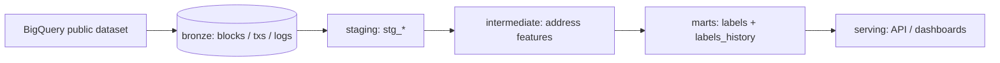
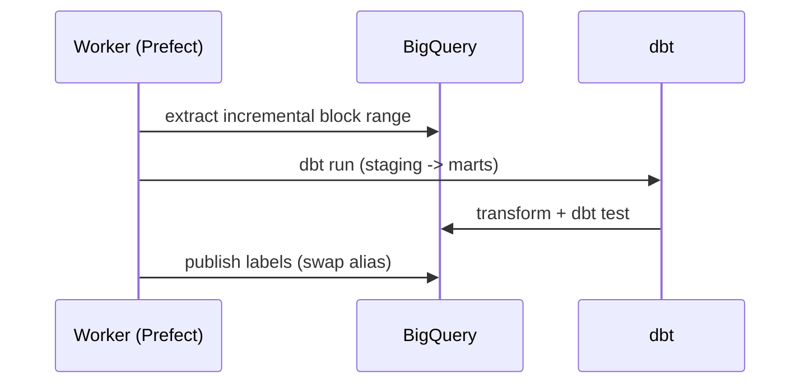

# Nansen: on-chain pipeline design

## 1. Introduction: (the "what")

### 1.1 Labelling

On-chain address labeling is a pretty open topic, with many companies and participants taking part in it with different approaches. We could summarize labelling as:

> *The process of adding a qualitative descriptor that provides information regarding the behavior, nature or origin of an address or address operator. We could extend this for other kinds of labels (like soft scores or quantiles) that are, in a similar fashion, summarized information tagging the address in question.*

It's important to take into account that a correct approach towards labelling should consider that:
- Labels are **timely**, e.g. they are aligned with a snapshot in time, dynamic, and mutable (we will talk about this in the data modeling part), there is a time dimension that needs to be part of our data model and our grain decision/s.
- Labels are **actionable**, they should be able to add information to act uppon.
- They should be **trustworthy**, either inferred from on-chain info or (in some cases) from external sources with high confidence.

The concept of labelling really is an open-ended problem. From a customer centric, bottom up approach, we need to understand who our customers & users are to derive what a valuable label means. Labels answer questions like:

- ***WHO is this entity?:*** exchanges, treasuries, protocol builders, whales, market makers, smart contracts (which may have automated behavior built in so are worth tracking, etc).
- ***WHAT does this entity do?:*** are they liquidity providers, speculators, MEV-like bots, smart contract / factory deployers, stakers, staking aggregators, routers, etc.
- ***WHY should users care?:*** e.g. what makes these addresses valuable for our users?

The reason why the bottom up approach is important is because our users directly dictate the value of a label. Imagine we are a staking infra provider who wants to operate for big funds, exchanges or entities (banks) to provide the staking infrastructure as a service. We really only care about these labels (not so much about smart traders or spoofers) since we use the labels as a sales tool to try to get customers.

*In the case of Nansen, where users will mainly be looking for:*
- Alpha: finding statistically significant sources of information that are not fully priced in and can provide risk adjusted returns that are better than holding a *traditional* weighted average portfolio.
- Beta: some users will be looking for sources of increased beta exposure (pump or vol), e.g. finding the next move of assets (or a subclass of assets like small cap tokens) that will, in case of a run, provide increased beta exposure. In other cases, users may want to do the opposite, find assets with positive alpha and low to zero beta (low correlation to the index or BTC).
- Sigma: raw exposure or hedging against future volatility moves.
These requirements should shape the kind of information we want our labels to provide.

> For instance; in CLOB chains where there is leverage and margin requirements, we could label addresses dynamically as `at_risk[bool]`. This would provide information regarding potential liquidations and be a proxy for future asset price moves when combined with other labels (e.g. liquidation of whales and big positions may cause price moves, short squeezes, etc.). It also serves the possibility of building aggregate metrics that could also be served at API level, such as timely aggregation of liquidations by price levels.

### 1.2 A generic data pipeline design recipe

When developing a new pipeline, we generally want to design it around the following principles and steps:

- Risk mitigation and research: we may lean on research and data exploration to verify the usefulness of a data source, through techniques like market research, user research (in case we are ingesting or transforming internal data coming from an internal service or source) and/or internal stakeholder collaboration (see our internal stakeholders as possible consumers of internal APIs and data).
- Once the hypothesis has been validated, we want to design the pipeline around the requirements, bottom up making sure we fulfill these requirements following principles such as simplicity, robustness, monitoring capabilities, scalability, data quality, backfilling / disaster recovery, and adaptability to our datamart API layer and current systems.
- In general, we may want to avoid adding new components to an already existing data platform if possible following the Occam's Razor principle; usually, the lesser the components, the more realiable a system (in general). However, the data requirements will dictate the system and architecture design. If we have a super basic data platform but our backend starts using an event based architecture, we may have to add an event queue ingestion and processing system. Or if we already have near real time mini-batch processing set up but a new data source requires low latency by design (e.g. its value heavily relies on low latency) we may have to adapt our system design and architecture to these requirements.
- Lastly, once the system implementation has been locked, we want to make sure it's reliable, scalable, measurable (it has to be easily monitored) and has the proper backfilling and disaster recovery mechanisms.

## 2. Approaches to on-chain address labeling (the "how")

This section will discuss different approaches (and just ideas that should be validated) to on-chain labelling that could be valuable to users looking for sources of alpha, risk mitigation or market neutrality.

### 2.1 Entity labels from external sources

Some entity-label providers like Glassnode, Arkham or Dune compile information from different web2 sources (reports, websites, information providers, API aggregators, etc) which may tag addresses as exchanges, fund treasuries, node operators, protocols/contract deployers, etc. They may also run sophisticated graph algorithms (for instance Glassnode does this for UTXO chains like BTC or BTC cash) or heuristics on EVMs to add soft labels to new addresses quicker than anyone else. These may be useful for users to track what big players or the overall market is doing (*are whales inactive? Are long term holders moving funds to exchanges? What are big funds' recent movements? How are staking operators' treasuries handling liquidity?*).

> *These are usually simple `ELT | poll -> normalize -> transform` pipelines. Poll from APIs (or listen to socket streams), parse, ingest and store. Then a classic layered data model will have an initial lower grain layer (bronze) where we just normalize different inputs to our desired schema, ensure id-grain level uniqueness and normally follow a slow-changing-dimension approach where we process our event timestamps to add a time grain and validity to labels (`timestamp_from`, `timestamp_to`, etc). For graph algorithms we may have more complex distributed jobs that come after our initial semantic layer, with heuristics written in plain `pySpark` or similar, but these are still linear pipelines.*

### 2.2 Behavioral & descriptive labels in EVMs (or similar)

EVMs (or similar chains) provide in depth information of a certain address's behavior in terms of:

- ***Native VM balances, token balances, token transfers, etc:*** these can provide information worth labelling like player size per token (whales, etc), long term holders (cohorts), active/inactive addresses (by number of transfers), etc.
- ***Interaction of an address with smart contracts; logs, traces, etc:*** with which we can know information such as: players providing liquidity in DEX pools (plus their impermanent loss or MTM), their positioning (are these providing buy side liquidity, e.g. are they providing *support* to the price, are they bull or bear LPs), their floating PnL (which could be predictive of future stops), or more advanced stuff like if they are providing double sided liquidity, are diversified and highly active (typical patterns of market makers). Other addresses may be deploying smart contracts, interacting with staking protocols (big stakers, fixed income crypto providers, etc), big lenders and others. These could also be interesting as their behavior does lead or lag price movements, just because of their sheer size of interaction with smart contracts.

> *In terms of system design and typical patterns for these kind of pipelines, we will discuss this further down the line as the first sample pipeline describes this in section ***3.1***; the approach towards these really depends on our requirements, a mini-batch near real-time pipeline can be quite simple, the 

### 2.3 Behavioral & descriptive labels in CLOB chains (L4 or similar)

CLOB chains (like HyperLiquid's HyperCore or Jupiter) provide deep information regarding the interaction of addresses with the chain's central limit order books. 

```
Behavioral, CLOB:
Age
Spoofing, cancel rates
Double sided liquidity
Tranching (funds)
Soft labeling
```

[ TODO ]

### 2.4 Smart Money (both EVM or CLOB): an alternative approach

```
Smart Money: rolling weighted portfolio, decoupling, etc
Rebalancing activity -> proxy for statistical significance
Can be proxied with rebalance / volume with respect to nominal value
Beta
Market neutrality
VaR and vol vs BTC vol
History
Insiders from on-chain info:
Protocols
```

[ TODO ]

## 3. Starter system design / architecture & pipeline sample

For a starter example of what a simple pipeline embedded in a data platform means, we will first describe the typical systems that embody a minimal data platform. In order to ensure simplicity, scalability, robustness, reliability and proper SLI / SLO / SLA trackin, we will usually want to have the following components:

- We will use a managed cluster paradigm like K8S as our distributed processing entity. This also allows us to easily control IaC (with systems like Terraform) and manage deployments through centralized deployment systems like Helm. Of course these are not required but moreso convenient to handle pod resources, memory, fault tolerance and scalability. It also will allow us in the future to have centralized monitoring quite easily and be cloud agnostic.
- We may have different services, usually polling services (like services pulling API data, scrapers, data connectors), long running services like stream listeners, internal service listeners, RPC node services, etc. These services will all live in our centralized processing entity, but their invocation may be triggered in different manners (read next). A central orchestration service (or services for multi service systems like Airflow or Prefect) will invoque polling services, trigger backfills, and may also be in charge of other random distributed transformation jobs and/or data quality testing. Long running services may shortcircuit our orchestrator directly, but we ideally still want to have some kind of sync backup jobs to cover backfill for these services (a classic example in web3 is a live running gRPC node streaming block events but then we may have an arhive node or an additional data source to handle backfills).
- Our system should have a cold storage system in addition to the cluster's shared memory and disk (like S3, GCS, etc). Following the modern ELT paradigm, we may want all of our services to write to cold storage the data "as raw as possible", we may use a modern Parquet schema catalog (like Iceberg) and manage schemas and data snapshots through that.
- On top of that, we will have our query engine, transformation services (like a semantic layer / dbt, spark transformations, etc), data quality assessment services (dbt / Great Expectations can be used here too) and an operational / analytics database system. Transformations, backfills, data quality jobs or others can be orchestrated from our centralized orchestration system. 
- Some modern systems (BigQuery, Snowflake, Clickhouse) may closely couple database and query engines, or we may want to use something like Trino/Databricks where data layout 

### 3.1 Sample pipeline

For our sample pipeline (well, a part of it) implementation, we will showcase a simple example of tracking active users / traders of a protocol, and show how through semantic tran

## 4. Real system design in a production environment (and link to a wip)

> NOTE: this is a full WIP I'm developing on the side, it will take a few weeks to have a full data platform as it's a complex project, but I'm open sourcing this here: [https://github.com/Cortajarena/hyperdata-platform/tree/main](https://github.com/Cortajarena/hyperdata-platform/tree/main). The intent of this project is to provide a boilerplate scaffold of a FULL data platform with all SOTA capabilities (explained in the README). It's a WIP, currently working on the ingestion layer, Kafka design, and some custom node+sidecar services to have proper ingestion for HyperCore and Iceberg Schema design.

***System description***:

[ TODO ]

As said, the ingestion layer is in progress and will be finished in a couple of days, including deployment to any K8S managed system (cloud agnostic)

---

## Appendix: diagram rendering smoke test (TEMP)

> Only here to prove the `mermaid -> HTML -> PDF` path renders diagrams.
> Delete this section once real diagrams land in **1.2** / **3**.




